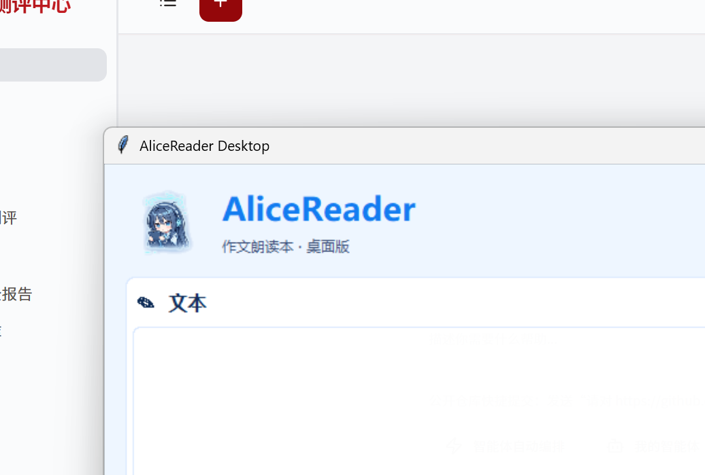

<br />
<p align="center">
  
  <h2 align="center" style="font-weight: 600">AliceReader Desktop</h2>
  <p align="center">
    
    
    
  </p>
  <p align="center">
    Windows 桌面版多渠道朗读工具，支持编辑器输入和全局快捷键导入选中文本。
    <br />
    <a href="https://github.com/moyuan10086/AliceReader-desktop"><strong>🌎 GitHub 仓库</strong></a>&nbsp;&nbsp;|&nbsp;&nbsp;
    <a href="https://github.com/moyuan10086/AliceReader-browser-extension"><strong>🧩 浏览器插件</strong></a>&nbsp;&nbsp;|&nbsp;&nbsp;
    <a href="LICENSE"><strong>📜 MIT License</strong></a>
  </p>
</p>

## ✨ 特性

- 编辑器输入或粘贴文本后一键朗读
- `Ctrl+Shift+S` 从其他应用导入当前选中文本
- MiniMax T2A、豆包 Speech、阿里百炼 Qwen3-TTS/CosyVoice
- 按渠道动态显示对应的音色、语言、情绪、速率和音频参数
- 本地缓存音频与历史记录，支持重复播放

设置窗口会按渠道动态切换参数，三套配置保存在 `providers.minimax`、`providers.doubao` 和 `providers.alibaba` 下。

## 📦 安装

需要 Windows、Python 3.10+ 和 `requests`：

安装依赖：

```powershell
pip install requests
```

## ▶️ 使用

双击 `start.vbs`，或运行：

```powershell
python main.py
```

首次启动后点击设置，选择朗读渠道并填写对应 API Key。也可以复制 `config.example.json` 为 `config.json` 后再启动。

## 🖼️ 截图


## ⚙️ 渠道参数

- **MiniMax T2A**：Voice ID、`language_boost`、`emotion`、`speed`、`volume`、`pitch`、采样率和码率。
- **豆包 Speech**：模型、`speaker` 音色和采样率。
- **阿里百炼**：Qwen3-TTS 或 CosyVoice；根据模型显示对应音色、语言、指令和速率参数。

设置窗口会按渠道动态切换参数，配置保存在 `providers.minimax`、`providers.doubao` 和 `providers.alibaba` 下。

## ⚠️ 安全说明

`config.json`、`cache/`、`records.json` 和 `__pycache__/` 已加入 Git 忽略规则。请勿将 API Key 提交到 GitHub。

## 📜 开源许可

本项目采用 [MIT License](LICENSE) 开源。
